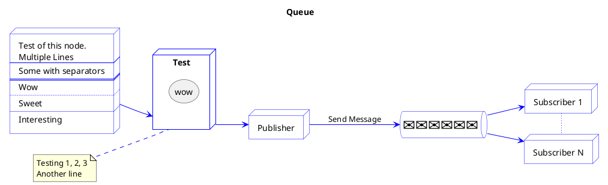

<!-- .slide: data-transition="zoom" -->
# Slide 1

---

<!-- .slide:  data-auto-animate -->
# Queue


```plantuml
@startuml
<style>
node {
    BackgroundColor: White
    LineColor: Blue
}
queue{
    BackgroundColor: White
    LineColor: Blue
}
arrow{
    LineColor: Blue
}
</style>

left to right direction

node nodePub as "Publisher"
queue queuePubSub as "<size:25>✉✉✉✉✉✉</size>"
node nodeSub as "Subscriber"

nodePub --> queuePubSub
queuePubSub --> nodeSub

@enduml
```

--

<!-- .slide:  data-auto-animate -->
# Queue


---

# Slide 3
```plantuml
@startuml
left to right direction

skinparam node {
    BackgroundColor White
    BorderColor Blue
}
skinparam queue {
    BackgroundColor White
    BorderColor Blue
}
skinparam arrow {
    Color Blue
}

node "Foo" as Test {
    storage A as "wow"
}
note left of Test
    Testing 1, 2, 3
    Another line
endnote

node "Publisher" as nodePub
queue "<size:25>✉✉✉✉✉✉</size>" as queuePubSub
node "Subscriber 1" as nodeSub1
node "Subscriber N" as nodeSubN

Test --> nodePub
nodePub --> queuePubSub : Send Message
queuePubSub --> nodeSub1
queuePubSub --> nodeSubN
nodeSub1 ~ nodeSubN
@enduml

---