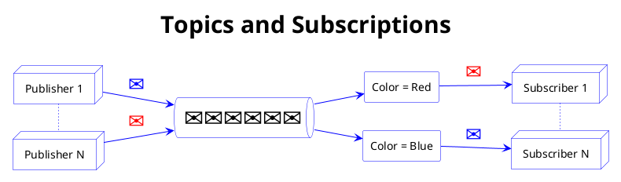

<!-- .slide: data-transition="zoom" -->
# Azure Event Hub
Victor Szalma

---


note:
    <li> An [event](https://docs.microsoft.com/en-us/azure/event-grid/compare-messaging-services#event) is a lightweight notification of a condition or a state change.
    <li> A [message](https://docs.microsoft.com/en-us/azure/event-grid/compare-messaging-services#message) is raw data produced by a service to be consumed or stored elsewhere. The message contains the data that triggered the message pipeline.
---

<!-- .slide: data-auto-animate -->
## Event Hubs Terminology


| Terminology	     | Concept                    |
| ------------------ | -------------------------- |
| Namespce	         | Management container       |
| Event Hub          | Individual topic           |
| Partition          | Log where event is written |
| Event Producer     | Entity that sends events   |
| Event Consumer     | Entity that reads events   |


note: Speaker notes
    <li> Part of service bus
    <li> Big data streaming
    <li> Event stream, clickstreams, live dashboards, etc.
    <li> AMPQ, HTTP, Apache Kafka
    <li> 1-32 partitions (Docs say min of 2, but 1 works)
    <li> Events are load balanced across partitions
    <li> Events are ordered within a partition
    <li> You can use a partition key when sending
    <li> You set up a consumer group for each application that will read from the event hub
    <li> A consumer group is a *view* into the event hub

--

<!-- .slide: data-auto-animate -->
## Event Hubs


note: Speaker notes
    <li> Part of service bus
    <li> Big data streaming
    <li> Event stream, clickstreams, live dashboards, etc.
    <li> AMPQ, HTTP, Apache Kafka
    <li> 1-32 partitions (Docs say min of 2, but 1 works)
    <li> Events are load balanced across partitions
    <li> Events are ordered within a partition
    <li> You can use a partition key when sending
    <li> You set up a consumer group for each application that will read from the event hub
    <li> A consumer group is a *view* into the event hub

--

## Event Hubs

<!-- .slide: data-auto-animate -->

{width="50%"}

- Push-Push processing model
- Multiple simultaneous consumers
- Consumers each read via a private cursor
- Consumers each read all of the messages

note: Speaker notes
    <li> Part of service bus
    <li> Big data streaming
    <li> Event stream, clickstreams, live dashboards, etc.
    <li> AMPQ, HTTP, Apache Kafka
    <li> 1-32 partitions (Docs say min of 2, but 1 works)
    <li> Events are load balanced across partitions
    <li> Events are ordered within a partition
    <li> You can use a partition key when sending

--

<!-- .slide: data-auto-animate -->
## Event Hub Namespaces


note:
    Speaker notes
    <li> Namespace defines units of scale, shared across each hub in namespace
    <li> Scaling of Throughput Unit (TU), Processing Unt (PU), Compute Unit (CU) depends on pricing tier
    <li> Auto-inflate will automatically scale your TUs, etc.
    <li> Each hub is like a topic in Kafka

--

<!-- .slide: data-auto-animate -->
## Event Publishing


note:
    <li> Partition keys can optionally be specified
        <ul>
            <li> If not provided, messages are load-balanced
            <li> If order is important, can provide partition key
        </ul>
    <li> Messages are ordered within a partition

--

<!-- .slide: data-auto-animate -->
## Event Hubs Partitions


note:
    <li> A partition can be thought of as a "commit log".
    <li> Partitions hold event data that contains:
        <ul>
            <li> Body of the event
            <li> User-defined property bag describing the event
            <li> Metadata such as its offset in the partition
            <li> Its number in the stream sequence
            <li> Service-side timestamp at which it was accepted
        </ul>
    <li> Defined at creation time
    <li> Impacts concurrent reads - single partition reader per consumer group

--

<!-- .slide: data-auto-animate -->
## Event Hubs Offsets

<blockquote style="font-size:24px;background-color:beige;text-align:center">
Note:
There was a question regarding offsets that I'm not sure I understood correctly so my answer may have been confusing. I added this slide to provide additional details.
</blockquote>
 
- Managing the offset is the responsibility of the consumer application
    - This includes saving the offset, deciding where to start reading, etc.
- Each event is provided an offset by Event Hubs
- [Reference documentation](https://docs.microsoft.com/en-us/azure/event-hubs/event-hubs-features#stream-offsets) 


note:
    <li> A consumer group is a **view** of the entire event hub.
    <li> You set up a consumer group for each application that will read from the event hub

--

<!-- .slide: data-auto-animate -->
## Event Hubs Consumer Groups


note:
    <li> A consumer group is a **view** of the entire event hub.
    <li> You set up a consumer group for each application that will read from the event hub

--

<!-- .slide: data-auto-animate -->
## Event Hubs Checkpoint


note:
    <li>Checkpointing is a process by which readers mark or commit their position within a partition event sequence.
    <li>Checkpointing is the responsibility of the consumer and occurs on a per-partition basis within a consumer group. 

--

<!-- .slide: data-auto-animate -->
## Event Capture


note:
    <li> Data is captured to blob storage/data lake
    <li> Data is stored in Avro format


--

<!-- .slide: data-auto-animate -->
## Event Hub and Kafka Apps

Kafka and Event Hub conceptual mapping

| Kafka Concept	     | Event Hubs Concept |
| ------------------ | ------------------ |
| Cluster	         | Namespace          |
| Topic	             | Event Hub          |
| Partition          | Partition          |
| Consumer Group     | Consumer Group     |
| Offset             | Offset             |

--

<!-- .slide: data-auto-animate -->
## Event Hub Availability

- New Namespace will have Availability Zones enabled if created in a Region that supports them
- Option to create mult-region paired Event Hub Geo-Disaster Recovery options to protect against Region-wide major failure
    1. Create primary namespace
    2. Create sedondary namespace in different Region
    3. Initiate pairing on primary namespace using Geo-recovery in portal pointing to secondary namespace 

--

<!-- .slide: data-auto-animate -->
## Service Bus Explorer


--

<!-- .slide: data-auto-animate -->
## Service Bus Explorer

- Open source tool for testing Service Bus and Event Hubs
- Documentation on [Github](https://github.com/paolosalvatori/ServiceBusExplorer) 
- Install via [Chocolatey](https://community.chocolatey.org/packages/ServiceBusExplorer) 

```
choco install ServiceBusExplorer
```


--

<!-- .slide: data-auto-animate -->
## Service Bus Explorer
Demo

note:
    <li> Show how to connect - Namespace connection string
    <li> Start listener for one of the CGs
    <li> Select Send Events on bus
        <ul>
            <li> Add individual event
            <li> Groups of events
        <ul>

--

### Additional Information

- [Subscription and service limits, quotas, and constraints](https://docs.microsoft.com/en-us/azure/azure-resource-manager/management/azure-subscription-service-limits)
- [Scaling with Event Hubs](https://docs.microsoft.com/en-us/azure/event-hubs/event-hubs-scalability)
- [Event Hubs quotas and limits](https://docs.microsoft.com/en-us/azure/event-hubs/event-hubs-quotas)
- [ServiceBusExplorer Chocolatey docs](https://community.chocolatey.org/packages/ServiceBusExplorer) 
- [ServiceBusExplorer Github docs](https://github.com/paolosalvatori/ServiceBusExplorer) 
- [Event Hubs Geo-disaster recovery](https://docs.microsoft.com/en-us/azure/event-hubs/event-hubs-geo-dr?tabs=portal) 
- [Security Baseline](https://docs.microsoft.com/en-us/security/benchmark/azure/baselines/event-hubs-security-baseline) 


---

<!-- .slide: data-auto-animate -->
## Azure Service Bus Queues

- Push-Pull semantics
- Ordered and timestamped
- Multiple senders and multiple receivers/consumers
- Consumers compete for messages
- Delivery Guarantee: At-lease once or at-most once

note:
    <li>There can be multiple senders and multiple receivers/consumers
    <li>Consumers compete for messages
    <li>Only one consumer can consume a message
    <li>Triple redundant storage
    <li>Service Bus entities exist in a namespace

--

<!-- .slide: data-auto-animate -->
## Azure Service Bus Topics

- Push-Pull semantics
- Ordered and timestamped
- Multiple publishers and multiple subscribers
- Multiple subscribers can read the same message

note:
    <li>Subscription filters use SQL syntax
    <li>A SQL <bold>action</bold> is used to manipulate message metadata after a message has been selected by a filter of a subscription rule
    <li>Push-push via SDK

--

<!-- .slide: data-auto-animate -->
## Azure Service Bus Topics



--

### Additional Service Bus Features
- Scheduled Delivery
- Auto Forwarding
- Auto Delete
- Duplicate Detection
- Sessions
- Batching
- Ordering
- Transactions
- Poison Message Handling

---

## Event Grid


note:
    <li> Event Grid is an eventing backplane that enables event-driven, reactive programming. It uses the publish-subscribe model. Publishers emit events, but have no expectation about how the events are handled. Subscribers decide on which events they want to handle.
    <li> [Event Grid Sources](https://docs.microsoft.com/en-us/azure/event-grid/overview#event-sources)
    <li> [Event Handlers](https://docs.microsoft.com/en-us/azure/event-grid/overview#event-handlers)

--

<!-- .slide: data-auto-animate -->
## Event Grid

{width="50%"}

- Dynamically scalable
- Low cost
- Serverless
- At least once delivery of an event
- Available on Edge and Kubernetes

note:
    <li> Event Grid is an eventing backplane that enables event-driven, reactive programming. It uses the publish-subscribe model. Publishers emit events, but have no expectation about how the events are handled. Subscribers decide on which events they want to handle.
    <li> [Event Grid Sources](https://docs.microsoft.com/en-us/azure/event-grid/overview#event-sources)
    <li> [Event Handlers](https://docs.microsoft.com/en-us/azure/event-grid/overview#event-handlers)
    <li> Simplicity - Point and click to aim events from your Azure resource to any event handler or endpoint.
    <li> Advanced filtering - Filter on event type or event publish path to make sure event handlers only receive relevant events.
    <li> Fan-out - Subscribe several endpoints to the same event to send copies of the event to as many places as needed.
    <li> Reliability - 24-hour retry with exponential backoff to make sure events are delivered.
    <li> Pay-per-event - Pay only for the amount you use Event Grid.
    <li> High throughput - Build high-volume workloads on Event Grid.
    <li> Built-in Events - Get up and running quickly with resource-defined built-in events.
    <li> Custom Events - Use Event Grid to route, filter, and reliably deliver custom events in your app.

--

## Event Grid Terminology
- **Events** - What happened.
- **Event sources** - Where the event took place.
- **Topics** - The endpoint where publishers send events.
- **Event subscriptions** - The endpoint or built-in mechanism to route events.
- **Event handlers** - The app or service reacting to the event.

note:
    <li> Subscription endpoints sometimes route to more than one handler. Subscriptions are also used by handlers to intelligently filter incoming events.

---

# End
